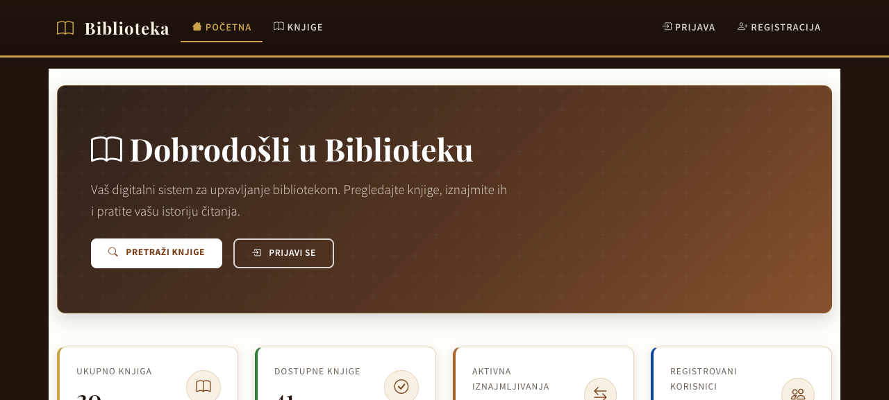
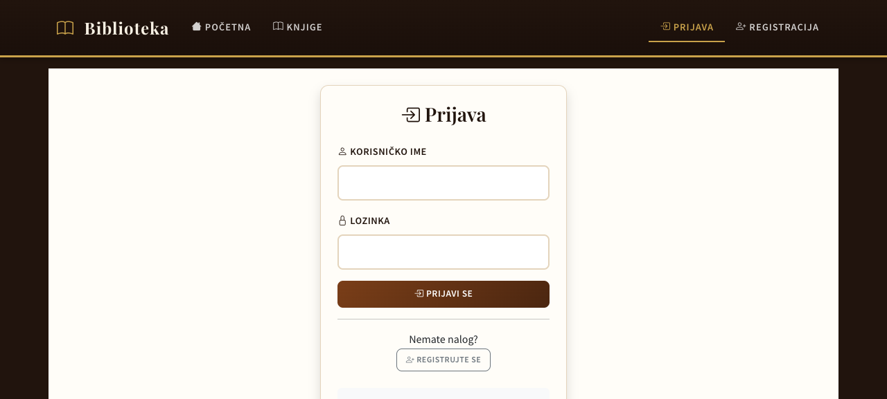
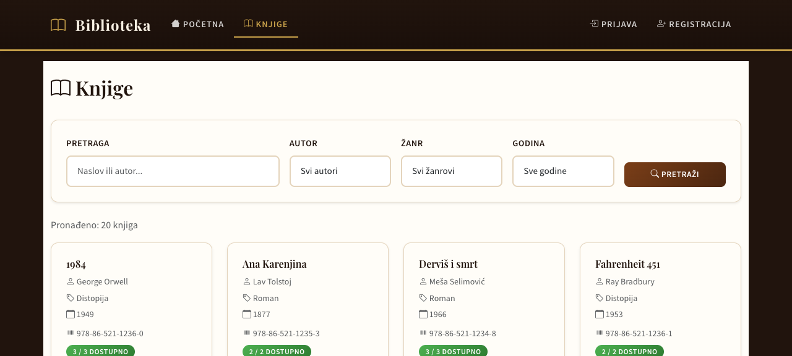
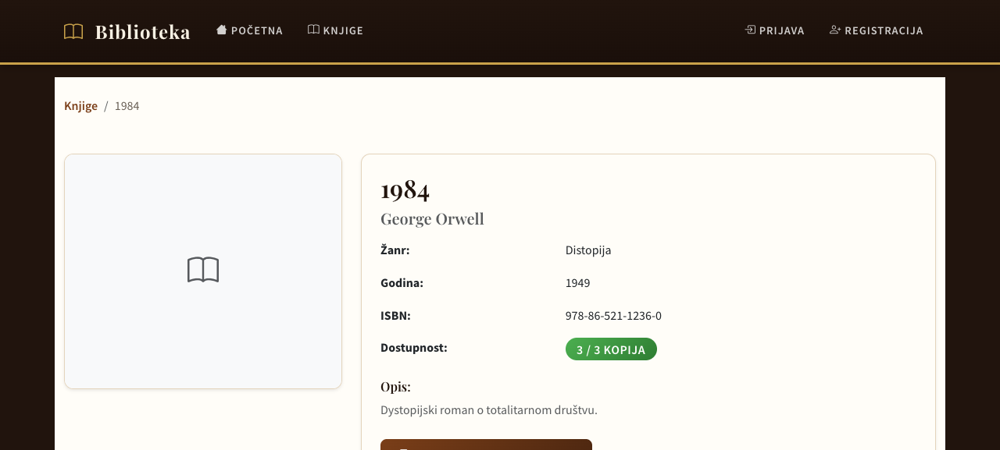
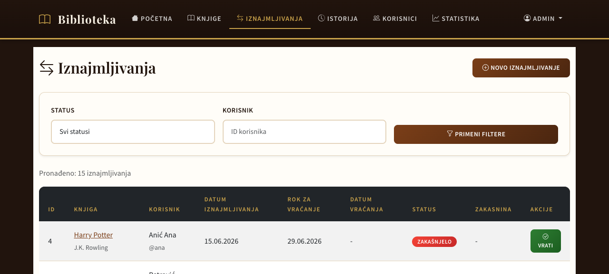
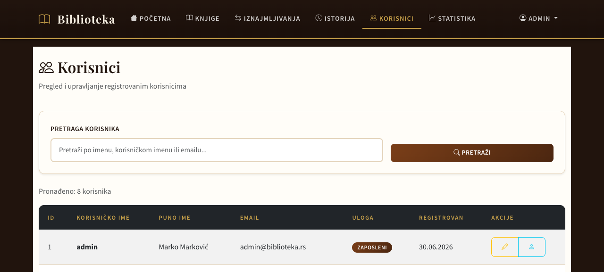
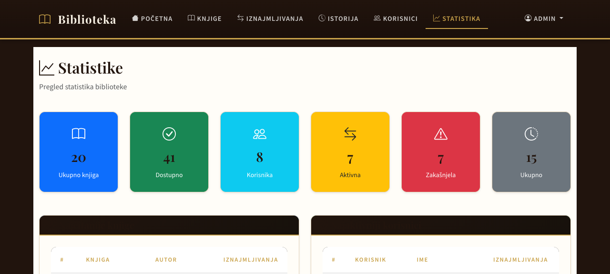

# Biblioteka

Biblioteka je PHP aplikacija za evidenciju knjiga, korisnika i iznajmljivanja. Projekat je napravljen bez framework-a, sa jasnom MVC podelom na kontrolere, modele i prikaze.

Demo: `https://zadatak-fakultet.page.gd/`

## Šta aplikacija radi

- vodi katalog knjiga sa autorom, žanrom, godinom, ISBN brojem i brojem primeraka
- omogućava prijavu, registraciju i dve uloge: korisnik i zaposleni
- korisnik može da pregleda knjige, iznajmi dostupnu knjigu i vidi svoju istoriju
- zaposleni može da dodaje i menja knjige, vraća knjige, pregleda korisnike i statistiku
- sistem računa zakasninu za knjige koje nisu vraćene na vreme

## Tehnologije

| Deo sistema | Tehnologija |
| --- | --- |
| Backend | PHP 7.4+ |
| Baza | MySQL 5.7+ / MariaDB 10.2+ |
| Frontend | HTML, CSS, Bootstrap 5, JavaScript |
| Arhitektura | MVC bez dodatnog framework-a |
| Hosting | InfinityFree |

## Struktura projekta

```
biblioteka/
├── config/
│   └── database.php          # Konfiguracija baze podataka
├── controllers/
│   ├── BaseController.php    # Zajedničko učitavanje prikaza
│   ├── PageController.php    # Početna, prijava, registracija, odjava
│   ├── BookController.php    # Rute i akcije za knjige
│   ├── RentalController.php  # Rute i akcije za iznajmljivanja
│   ├── UserController.php    # Rute i akcije za korisnike
│   └── StatisticsController.php # Statistika za zaposlene
├── models/
│   ├── User.php             # Model za korisnike
│   ├── Book.php             # Model za knjige
│   └── Rental.php           # Model za iznajmljivanja
├── views/
│   ├── layouts/
│   │   ├── header.php       # Zaglavlje stranice
│   │   └── footer.php       # Podnožje stranice
│   ├── auth/
│   │   ├── login.php        # Stranica za prijavu
│   │   └── register.php     # Stranica za registraciju
│   ├── books/
│   │   ├── index.php        # Lista knjiga sa filterima
│   │   ├── show.php         # Detalji knjige
│   │   ├── create.php       # Dodavanje nove knjige
│   │   └── edit.php         # Izmena knjige
│   ├── rentals/
│   │   ├── index.php        # Lista iznajmljivanja
│   │   ├── create.php       # Novo iznajmljivanje
│   │   └── history.php      # Istorija iznajmljivanja
│   ├── users/
│   │   ├── index.php        # Lista korisnika
│   │   ├── profile.php      # Profil korisnika
│   │   └── edit.php         # Izmena profila
│   └── statistics/
│       └── index.php        # Statistike biblioteke
├── css/
│   └── style.css            # Prilagođeni stilovi
├── js/
│   └── app.js               # Prilagođeni JavaScript
├── public/
│   ├── index.php            # Glavni ulazni fajl aplikacije
│   ├── .htaccess            # Apache konfiguracija
│   ├── css/
│   │   └── style.css        # Prilagođeni stilovi
│   └── js/
│       └── app.js           # Prilagođeni JavaScript
├── helpers/
│   ├── auth.php             # Pomoćne funkcije za autentifikaciju
│   └── functions.php        # Opšte pomoćne funkcije
├── database/
│   ├── schema.sql           # Struktura baze podataka
│   ├── seed.sql             # Test podaci
│   └── backup.sql           # Kompletni SQL bekap
└── docs/
    ├── Biblioteka-dokumentacija.docx # Objedinjena dokumentacija za predaju
    ├── er-dijagram.drawio          # ER dijagram (Chen notacija)
    ├── dokumentacija-baze.md       # Dokumentacija baze podataka
    ├── infinityfree-postavka.md    # Uputstvo za InfinityFree hosting
    └── korisnicka-dokumentacija.md # Korisničko uputstvo
```

## Instalacija

Lokalno pokretanje:

1. Kopirati projekat u `htdocs` direktorijum XAMPP/WAMP/MAMP okruženja.
2. U phpMyAdmin-u napraviti bazu za aplikaciju.
3. Importovati `database/schema.sql`, zatim `database/seed.sql`.
4. Otvoriti aplikaciju kroz lokalni server.

Postavljanje na hosting:

1. Na InfinityFree panelu napraviti MySQL bazu.
2. Importovati `database/backup.sql` kroz phpMyAdmin.
3. U `config/database.php` uneti podatke za konekciju.
4. Uploadovati fajlove u `htdocs/`.

## Konfiguracija baze

`config/database.php` koristi vrednosti iz environment promenljivih ako postoje, a u suprotnom primer vrednosti za hosting:

```php
define('DB_HOST', getenv('DB_HOST') ?: 'sqlXXX.infinityfree.com');
define('DB_PORT', getenv('DB_PORT') ?: '3306');
define('DB_NAME', getenv('DB_NAME') ?: 'if0_XXXXXXX_biblioteka');
define('DB_USER', getenv('DB_USER') ?: 'if0_XXXXXXX');
define('DB_PASS', getenv('DB_PASS') ?: 'CHANGE_ME');
```

Stvarna lozinka baze ne ide u repozitorijum.

## Uloge

| Uloga | Mogućnosti |
| --- | --- |
| Korisnik | pregled knjiga, iznajmljivanje, istorija, profil |
| Zaposleni | knjige, korisnici, vraćanje knjiga, statistika |

## Baza podataka

Glavne tabele:

- `users` - nalozi i uloge korisnika
- `books` - knjige i broj primeraka
- `rentals` - iznajmljivanja, rokovi, status i zakasnina

Relacije:

- `rentals.user_id` → `users.id`
- `rentals.book_id` → `books.id`

Baza je opisana detaljnije u [docs/dokumentacija-baze.md](docs/dokumentacija-baze.md).

## Sigurnost

- lozinke se proveravaju preko `password_hash()` i `password_verify()`
- SQL upiti koriste prepared statements
- korisnički unos se pri ispisu obrađuje kroz `htmlspecialchars()`
- uloge se proveravaju pre pristupa stranicama za zaposlene

## Test nalozi

Lozinka za test naloge je `password`.

| Korisničko ime | Uloga | Ime |
| --- | --- | --- |
| admin | Zaposleni | Marko Marković |
| zaposleni1 | Zaposleni | Jovan Jovanović |
| zaposleni2 | Zaposleni | Ana Anić |
| petar | Korisnik | Petrović Petar |
| mika | Korisnik | Mikić Mika |
| zika | Korisnik | Žikić Žika |
| ana | Korisnik | Anić Ana |
| jelena | Korisnik | Jelenić Jelena |

## Dokumentacija

- [Word dokumentacija](docs/Biblioteka-dokumentacija.docx) - objedinjeni opis aplikacije, baze, relacija, ER dijagrama i ekrana
- [Dokumentacija baze](docs/dokumentacija-baze.md) - tabele, atributi, relacije, indeksi i normalizacija
- [Korisničko uputstvo](docs/korisnicka-dokumentacija.md) - tokovi korišćenja za korisnika i zaposlenog
- [InfinityFree postavka](docs/infinityfree-postavka.md) - postavljanje aplikacije i import baze
- [ER dijagram](docs/er-dijagram.drawio) - originalni draw.io fajl

## Ekrani aplikacije

### Početna stranica



### Prijava



### Lista knjiga



### Detalj knjige



### Iznajmljivanja



### Korisnici



### Statistika



## Predaja

Za predaju su relevantni:

- kompletan kod aplikacije
- SQL fajlovi iz `database/`
- Word dokumentacija iz `docs/Biblioteka-dokumentacija.docx`
- ER dijagram iz `docs/er-dijagram.drawio`
- screenshotovi iz `docs/screenshots/`
